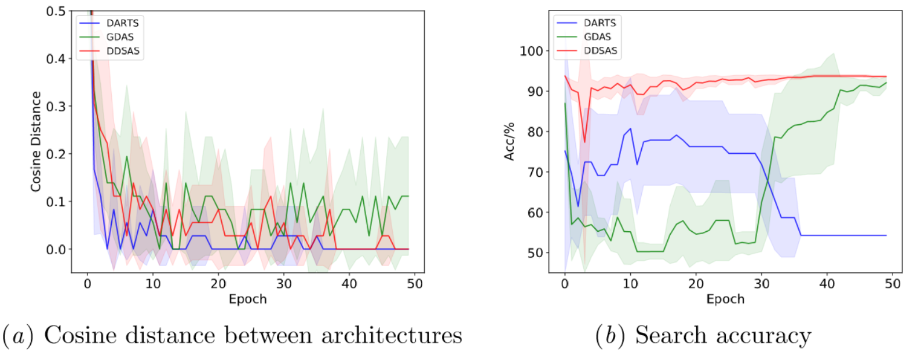
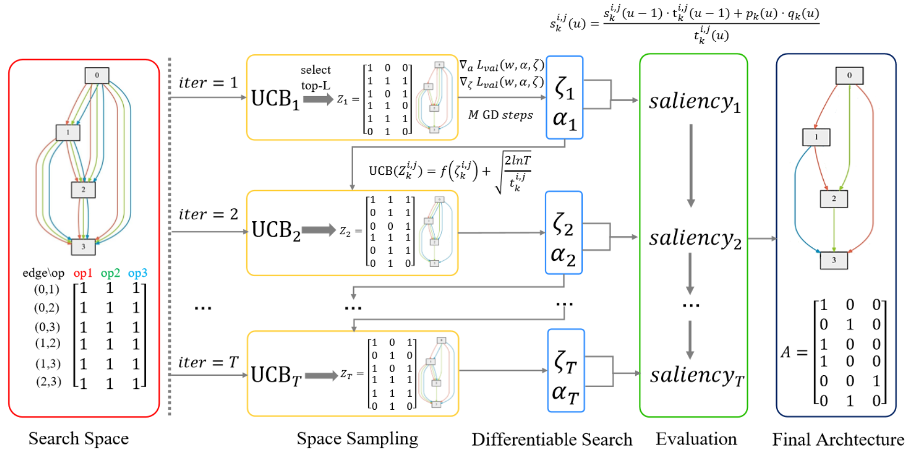

# DDSAS: Dynamic and Differentiable Space-Architecture Search (ACML 2021)


This is an official pytorch implementation for "DDSAS: Dynamic and Differentiable Space-Architecture Search". 



## Requirements
* Python 3.6.8
* PyTorch 1.4.0


## Usage

### Data preparation
Download CIFAR10/CIFAR100/ImageNet dataset and place them in .data/ folder.

To obtain the dataset for ImageNet search, run: 
```shell
python imagenet_split.py
```

### Model Evaluation
Pre-trained checkpoints are released [google drive](https://drive.google.com/drive/folders/1LitqqhaZC69Qzc60pBzqkY__zdjNOFQC?usp=sharing)/[baiduyun](https://pan.baidu.com/s/1qfsOOpTEY29e1W43ckLwfA). Place them in the .weights/ folder.

Note: access code for `baiduyun` is `ddsa`.


To evaluate a pre-trained DDSAS model on CIFAR10/CIFAR100/ImageNet, run:
```shell
bash shell/eval_cifar10.sh
bash shell/eval_cifar100.sh
bash shell/eval_imagenet.sh
```


### Model Search
To search a DDSAS model on CIFAR10/CIFAR100/ImageNet, run:
```shell
bash shell/search_cifar10.sh
bash shell/search_cifar100.sh
bash shell/search_imagenet.sh
```

To search a DDSAS model in a shrinking/expanding search space on CIFAR10/CIFAR100, run:
```shell
bash shell/search_cifar10_shrink.sh
bash shell/search_cifar10_expand.sh
bash shell/search_cifar100_shrink.sh
bash shell/search_cifar100_expand.sh
```

### Model Retraining
To retrain a DDSAS on CIFAR10/CIFAR100/ImageNet, run:
```shell
bash shell/retrain_cifar10.sh
bash shell/retrain_cifar100.sh
bash shell/retrain_imagenet.sh
```

## Citation
Please cite our paper if you find anything helpful.
```
@InProceedings{yang21,
      title = {DDSAS: Dynamic and Differentiable Space-Architecture Search},
      author = {Yang, Longxing and Hu, Yu and Lu, Shun and Sun, Zihao and Mei, Jilin and Zeng, Yiming and Shi, Zhiping and Han, Yinhe and Li, Xiaowei},
      booktitle={ACML},
      year={2021}
    }
```


## License
MIT License

## Acknowledgement
This code is heavily borrowed from [DARTS](https://github.com/quark0/darts) and [SGAS](https://github.com/lightaime/sgas). Great thanks to their contributions.
